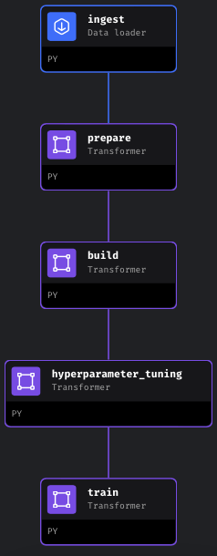

# MLOps Diabetes Prediction

<a target="_blank" href="https://cookiecutter-data-science.drivendata.org/">
    
</a>

## Project Overview

Diabetes is a chronic medical condition that affects millions of people worldwide. It is characterized by high levels of sugar (glucose) in the blood, which can lead to serious health complications if not properly managed. This project leverages machine learning techniques to predict the likelihood of diabetes in patients and to assist in the management of the condition through data-driven insights.

Important: This project is designed to provide predictions and insights based on data but does not replace a medical diagnosis. Always consult with a healthcare professional for a definitive diagnosis and personalized medical advice.

--------
## Table of Contents

- [Project Overview](#project-overview)
- [Orchestration](#orchestration)
- [Web Service](#web-service)
- [Monitoring](#monitoring)
- [Installation](#installation)

## Orchestration
To start the Mage interface , use the following command:

```
mage start src/mlops
```

To start the orchestration process for running the MLOps pipeline, run the `diabetes_pipeline` in the Pipelines section.



This pipeline, defined in the src/mlops directory, handles tasks such as data preprocessing, model training, and evaluation. In the final stage of the MLOps pipeline, the model is first registered and then transitioned to the production environment. This decision is based on the assumption that the model, having undergone extensive hyperparameter tuning and validation, represents the best-performing version available. The registration process ensures that the model is properly cataloged in the MLflow model registry. Transitioning to production signifies that this model has met the necessary performance criteria and is deemed ready for deployment in a live setting.

## Web Service

To build and run the web service that serves the diabetes prediction model, navigate to the web-service-mlflow directory and use the following commands:

### Build the Docker Image
```
docker build -t diabetes-prediction-service:v1 .
```
### Run the Docker Container
```
docker run -it --rm -e AWS_PROFILE=mlflow-profile -v ~/.aws:/root/.aws -p 9696:9696 diabetes-prediction-service:v1
```
This command runs the web service in a Docker container, making it accessible on port 9696. The service can be used to send patient data and receive diabetes predictions. Additionally, the API can be tested using the test.py file.

## Monitoring
To create a report, use the monitoring.ipynb file in the notebooks directory. After generating the report, you can monitor the deployed models using Evidently AI. Navigate to the src/monitoring directory and start the UI with:

```
cd src/monitoring && evidently ui
```
This command launches the Evidently UI, providing a dashboard for monitoring the model’s performance over time, ensuring its predictions remain accurate and reliable.

Additionally, you can build a Docker Compose file to visualize the data using Grafana with the following command:
```
docker-compose up
```
Note: The visualization feature is still under development. Currently, data is saved in PostgreSQL but cannot be fully visualized yet. I am working on simulating synthetic data to improve visualization in Grafana over time.

## Installation

### Prerequistes 
    - Prerequisites
    - Python 3.10
    - Pipenv
    - Docker
    - AWS CLI (for managing AWS profiles)

### Steps
1. **Clone the repository:**

    ```bash
    git clone https://github.com/your-username/mlops-diabetes.git
    ```

2. **Navigate to the project directory:**

    ```bash
    cd mlops-diabetes
    ```

3. **Install dependencies using `pipenv`:**

    ```bash
    pipenv install --dev
    ```

4. **Activate the Pipenv shell:**

    ```bash
    pipenv shell
    ```

5. **Install the project as a module using `setup.py`:**

    ```bash
    pipenv install --editable .
    ```

6. **Set up your AWS credentials:**

    ```bash
    aws configure --profile mlflow-profile
    ```
    *Note:* Ensure that your profile is correctly configured in the ~/.aws/credentials and ~/.aws/config files.

This setup ensures that your Python paths are correctly handled and that all dependencies are properly managed using `pipenv`.


